# 🔐 Knowledge Your Password

Hi, my name is **Tran Nguyen Thai Tuan**.

This small project was created to **raise awareness about password security** and encourage everyone to use stronger, safer passwords in daily life.  
Everything runs entirely in the browser — **no passwords are stored, logged, or sent anywhere**.  
This project is built for learning, experimentation, and promoting better password hygiene for everyone.

---

## 📑 Table of Contents

- [Features](#features)
- [System Architecture](#system-architecture)
- [Getting Started](#getting-started)
- [API Usage](#api-usage)
- [Web Interface](#web-interface)
- [Notes](#notes)

---

## ✨ Features

- Check password strength instantly in your browser
- 100% client-side: **no password is ever sent to a server**
- Simple FastAPI backend for password data
- Educational purpose

---

## 🏗️ System Architecture

<p align="center">
  
</p>

---

## 🚀 Getting Started

### 1. Set up the environment

- Ensure you have **Python 3.8+** installed.

- Open terminal and navigate to the project folder:
  ```sh
  cd path\to\knowledge_your_password
  ```

- Install required libraries:
  ```sh
  pip install -r requirements.txt
  ```

### 2. Run the server

- Start the FastAPI server:
  ```sh
  uvicorn main:app --reload --host 0.0.0.0 --port 5583
  ```
- The server will run at:  
  [http://127.0.0.1:5583](http://127.0.0.1:5583)

---

## 📡 API Usage

- **Get 100 common weak passwords**
  ```
  GET /api/weak100
  ```

- **Get 100 random common weak passwords**
  ```
  GET /api/weak100/randomlist
  ```

---

## 🌐 Web Interface

- Open `index.html` in your browser and enjoy!
- Or you can see my demo directly here: [Live Demo](https://hatvaqua.online)

---


## 📝 Notes

- This project runs locally and **does not save any user's password**.
- For educational and awareness purposes only.

---

**Thank you for checking out this project!**  
Feel free to contribute or give feedback.